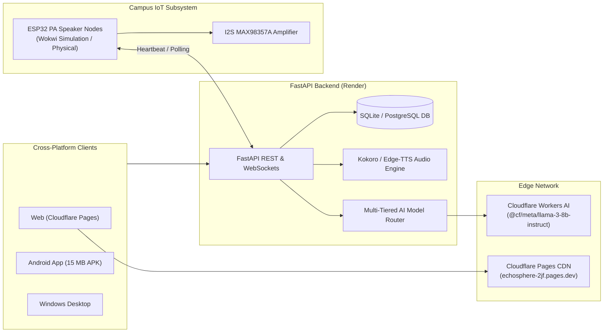

<div align="center">

# 🌐 EchoSphere

### Smart AI-Powered Campus Announcement & Public Address Management System

[](https://echosphere-2jf.pages.dev/)
[-success?style=for-the-badge&logo=android&logoColor=white)](https://github.com/rrakshu60-dotcom/Echosphere/releases/download/latest/echosphere-app.apk)
[](https://flutter.dev/)
[](https://echosphere-backend-9lv8.onrender.com/docs)

<br/>

**[🚀 Launch Live Web Application](https://echosphere-2jf.pages.dev/)** • **[📱 Download Android APK (15 MB)](https://github.com/rrakshu60-dotcom/Echosphere/releases/download/latest/echosphere-app.apk)** • **[📡 API Swagger Docs](https://echosphere-backend-9lv8.onrender.com/docs)**

---

</div>

## 📌 Live Access & Direct Links

| Channel | Platform | Access Link / Artifact |
| :--- | :--- | :--- |
| 🌐 **Live Web Application** | Cloudflare Pages | **[https://echosphere-2jf.pages.dev/](https://echosphere-2jf.pages.dev/)** |
| 📱 **Mobile Application** | Android (ARM64) | **[Download echosphere-app.apk (15 MB)](https://github.com/rrakshu60-dotcom/Echosphere/releases/download/latest/echosphere-app.apk)** |
| 💻 **Desktop Application** | Windows (x64) | **[GitHub Releases `latest`](https://github.com/rrakshu60-dotcom/Echosphere/releases/tag/latest)** |
| ⚡ **Backend REST API** | FastAPI / Render | **[https://echosphere-backend-9lv8.onrender.com/docs](https://echosphere-backend-9lv8.onrender.com/docs)** |
| 📟 **Hardware Simulator** | Wokwi ESP32 Node | Run `wokwi.toml` simulation locally or in browser |

---

## 🔑 Quick Demo Credentials

Test the platform instantly across all campus administrative and academic roles:

| Role | Email | Password | Permissions & Capabilities |
| :--- | :--- | :--- | :--- |
| **Dev Administrator** | `devadmin@echosphere.edu` | `Admin@123` | Full system control, AI router config, hardware node monitor |
| **Principal** | `principal@echosphere.edu` | `Admin@123` | Campus-wide broadcast approval, emergency siren trigger |
| **Head of Dept (HoD)** | `hod@echosphere.edu` | `Admin@123` | Department notice moderation, faculty approval workflows |
| **Teacher / Faculty** | `teacher@echosphere.edu` | `Admin@123` | Draft announcements, AI notice generator, class notices |
| **Student** | `student@echosphere.edu` | `Admin@123` | Filtered notice feed, category bookmarks, audio broadcast listener |

---

## 🌟 Key Features

* **Multi-Tiered AI Model Router**: Automatically routes notice drafting and urgency classification between **Local Fine-Tuned Gemma 2 (RTX 4060)**, **Cloudflare Workers AI**, and **Gemini 3.6 Flash**.
* **Smart PA Audio Subsystem**: Text-to-Speech synthesis (Kokoro-82M neural model + Microsoft Edge-TTS + gTTS fallback) streaming directly to physical and virtual speaker hardware.
* **ESP32 IoT PA Speaker Nodes**: Real-time heartbeat telemetry, automatic Wi-Fi registration, command polling, and emergency PA siren broadcasts.
* **Instant Responsive UI**: Built with Flutter 3.24+, guaranteeing zero overflow across all screen formats from compact mobile screens to 4K desktop dashboards.
* **Ultra-Lean Delivery**: Fully optimized AOT compilation and R8 code/resource shrinking bringing APK size down to just **15 MB**.

---

## 🏗️ Technical Architecture



---

## 🚀 Local Quickstart & Deployment

### 1. Direct Web Instant Deployment to Cloudflare Pages (30s)
```powershell
.\deploy.ps1
```

### 2. Publish Android APK & Windows App to GitHub Releases (1-Click)
```powershell
.\publish-release.ps1
```
*Builds Android APK & Windows Desktop binaries locally and uploads them directly to [GitHub Releases `latest`](https://github.com/rrakshu60-dotcom/Echosphere/releases/tag/latest).*

### 3. Fast Local Builds Only
```powershell
.\build-apk.ps1       # Build Android APK locally (~15 MB)
.\build-windows.ps1   # Build Windows Desktop App locally
```

### 4. Run Backend Server
```bash
cd backend
python -m venv .venv
source .venv/bin/activate  # or .venv\Scripts\activate on Windows
pip install -r requirements.txt
uvicorn app.main:app --reload --port 8000
```


---

<div align="center">
  <sub>EchoSphere Campus Intelligence Platform • Built for SIH 2026</sub>
</div>
